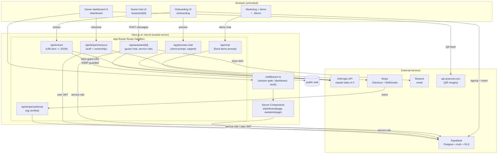
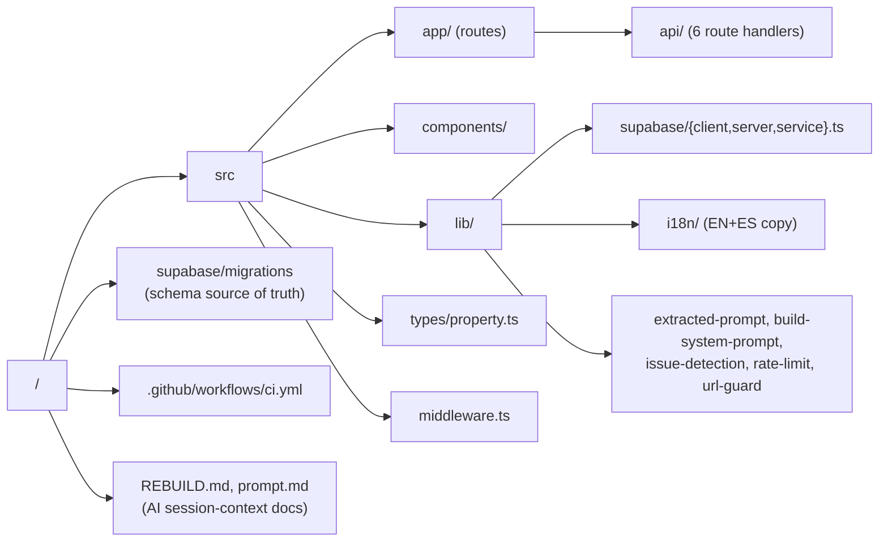
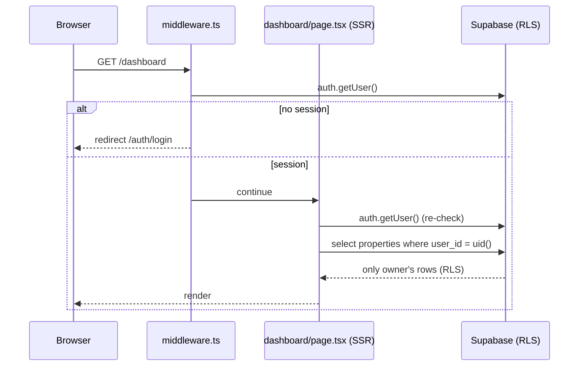
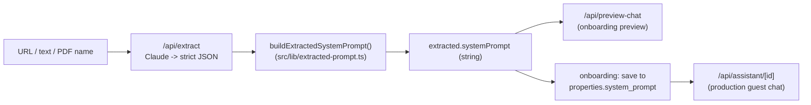
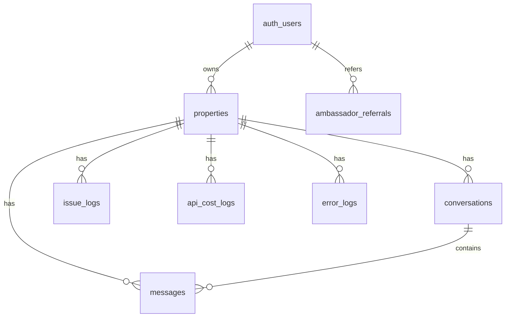
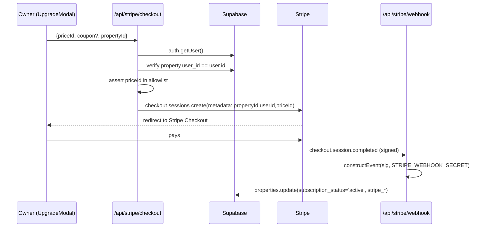

# Place Companion — CTO Technical Handoff

Status: current as of branch `handoff-hardening`, 2026-07-01.
Audience: incoming CTO. Assumes strong engineering background, zero prior exposure to this repository.
Scope rule: every statement below is grounded in the repository, git history, live database introspection, or verified runtime behavior. Anything not verifiable is labeled **UNKNOWN** or attributed to its source. Nothing is speculative unless in §15/§16 and explicitly marked.

---

## 1. Executive Summary

**What it is.** Place Companion is a single-tenant-per-property SaaS web application that gives a boutique hotel an AI "guest companion" — a chat assistant, reachable at a public URL/QR code, that answers guest questions about the property and destination, and escalates maintenance issues to staff by email.

**Why it exists / problem solved.** Independent hotels lack 24/7 multilingual front-desk coverage. The product converts a hotel's existing website/text into a property-specific assistant in minutes (self-serve onboarding), and surfaces guest maintenance issues to the owner in real time.

**Current maturity.** Early production MVP. Roughly 9–10k lines of TypeScript/TSX across ~60 tracked source files (the largest single files are the marketing homepage `src/app/page.tsx` (~1,280 lines), `DashboardClient.tsx` (~905), and the EN/ES copy module `translations.ts` (~896)). One framework (Next.js App Router), one AI provider (Anthropic), one database (Supabase/Postgres), one payment provider (Stripe), one email provider (Resend). No feature flags, no background workers, no caching layer, no multi-region concerns.

**Current deployment state.**
- Database: Supabase project `fhrgapgrxmbkjwearixc`, `ACTIVE_HEALTHY`, `us-east-1`, Postgres 17. All 8 application tables exist with RLS enabled and currently hold **0 rows** (verified via introspection). There is no production traffic/data yet.
- Hosting: Vercel, project `placecompanion-v2`, domain `placecompanion.com` — **per `REBUILD.md`; not independently verified in this handoff.**
- Stripe: test mode; the two price IDs referenced by the app are live and active in the connected account (verified).
- The hardening branch `handoff-hardening` (4 commits) is **not yet pushed**; CI has therefore **not yet executed on GitHub**.

**Biggest strengths.**
1. Small, single-stack, fully typed (`tsc --strict` passes). Low conceptual surface area.
2. Trust boundaries are now correct: guest-facing AI and DB access are server-mediated; RLS is locked and verified by live probe.
3. Reproducible: schema is captured as migrations; `next build` runs with no secrets; CI enforces lint + types + tests + build.

**Biggest limitations.**
1. Three near-duplicate chat UI implementations (historical) — see §11 MEDIUM-1.
2. Rate limiting is in-memory per serverless instance — coarse abuse protection, not a global quota (§9, §11 MEDIUM-2).
3. Billing has an unresolved price-configuration discrepancy that requires a business decision (§8, §16).
4. Documentation drift: `REBUILD.md` describes routes/features that do not exist in code (§4).

---

## 2. Product Philosophy

**Intentionally optimized:**
- **Time-to-value for the hotelier.** Onboarding (`/onboarding`) extracts structured data from a URL/text/PDF-name and produces a working assistant preview before account creation. The "magic moment" is the priority.
- **Design consistency.** A fixed dark design system (documented in `prompt.md` / `REBUILD.md`) is applied via inline styles. Colors/typography are treated as near-constants.
- **Server authority over AI and data.** After hardening, prompts and privileged DB access live server-side.

**Intentionally deferred (MVP, not permanent):**
- Multi-vertical support. The type system (`src/types/property.ts`) and `src/lib/build-system-prompt.ts` enumerate six verticals (`hotel_resort`, `hospital_clinic`, `airport_transport`, `residential`, `shopping_retail`, `university_campus`), but only `hotel_resort` is exercised. This is scaffolding for a planned generalization (§15, Planned).
- Admin/command-center (`/admin`), analytics tables (`api_cost_logs`, `agent_memory_logs`, `error_logs`, `ambassador_referrals`) — the tables exist; the code paths that write/read them do not (§7, §15).
- Observability: logging is `console.*` only. No error reporting service.
- Test breadth: only pure-logic units are tested (§10).

**Why the architecture looks the way it does.** It is a Vercel-native Next.js App Router app. Every server capability is an App Router Route Handler; there is no separate backend service. Supabase provides auth + Postgres + RLS in one dependency, which is why authorization is expressed as SQL policies rather than application middleware. This is a deliberate "as few moving parts as possible" MVP posture.

**MVP vs permanent.**
- Permanent: Next.js App Router, Supabase-as-backend, Anthropic via Vercel AI SDK, RLS-as-authorization, server-side AI.
- MVP/transitional: single hotel vertical, in-memory rate limiting, three chat components, hardcoded Stripe price IDs in the client, `console.*` logging.

---

## 3. High-Level Architecture

### 3.1 Component & trust-boundary diagram



### 3.2 Trust boundaries (explicit)

1. **Browser → Route Handler.** Everything from the browser is untrusted. Request bodies are shape-validated and length-capped in the AI/checkout routes. `/api/chat` ignores any client-supplied prompt.
2. **Route Handler → Supabase.** Two client types:
   - **Anon/user-JWT client** (`src/lib/supabase/{client,server}.ts`) — carries the end user's session; RLS applies. Used by the dashboard and auth.
   - **Service-role client** (`src/lib/supabase/service.ts`) — bypasses RLS. Used only server-side for guest chat persistence, the public assistant page read, and the Stripe webhook. The service-role key never reaches the browser.
3. **Stripe → webhook.** Untrusted until the signature is verified with `STRIPE_WEBHOOK_SECRET` (`constructEvent`). Only then does it mutate `properties`.
4. **`/api/extract` → public web.** The endpoint fetches a guest-supplied URL. It is SSRF-guarded (public http(s) only; private/loopback/link-local rejected pre- and post-redirect) and rate-limited.

### 3.3 External dependencies (why each exists)

| Dependency | Purpose | Coupling |
|---|---|---|
| Anthropic (`@ai-sdk/anthropic`, `ai`) | LLM for chat + extraction. Model `claude-haiku-4-5-20251001` everywhere. | Server-only; keyed by `ANTHROPIC_API_KEY`. |
| Supabase (`@supabase/ssr`, `@supabase/supabase-js`) | Auth + Postgres + RLS. | The backend. Auth and authorization both live here. |
| Stripe (`stripe`) | Subscriptions. | Server-only. |
| Resend (`resend`) | Issue-alert emails to owners. | Server-only; `RESEND_API_KEY`. Sender is `onboarding@resend.dev`. |
| `api.qrserver.com` | QR image generation for the public assistant URL. | Client-side `fetch`, no key. External image API. |
| `recharts` | Dashboard/marketing charts. | Client-only. |
| `lucide-react` | Icons. | Client-only. |

---

## 4. Repository Structure



| Path | Why it exists | Notes |
|---|---|---|
| `src/app/` | App Router pages + API. All routing and server logic. | Public: `/`, `/features`, `/about`, `/privacy`, `/terms`, `/demo`, `/onboarding`, `/auth/{login,signup}`, `/assistant/[id]`. Protected: `/dashboard`, `/dashboard/properties/[id]`. |
| `src/app/api/` | The only server business logic. Six route handlers. | `chat`, `preview-chat`, `extract`, `assistant/[id]`, `stripe/checkout`, `stripe/webhook`. |
| `src/components/` | Shared UI. | Contains **three** chat UIs — see below and §11. |
| `src/lib/supabase/` | Three Supabase client factories. | `client` (browser), `server` (user JWT via cookies), `service` (service role, RLS bypass). |
| `src/lib/i18n/` | All UI copy, EN + ES, in one typed module (`translations.ts`), plus `LanguageContext`. | No i18n framework; a typed object keyed by `en`/`es`. |
| `src/lib/extracted-prompt.ts` | **Single source of truth** for the guest-assistant system prompt built from extractor output. | Introduced during hardening to fix the preview≠production bug (§13). |
| `src/lib/{rate-limit,url-guard,issue-detection}.ts` | Server helpers extracted so they are unit-testable and reusable. | Added/relocated during hardening. |
| `src/lib/marazul-config.ts` | The fixed demo hotel ("MarAzul Riviera Maya") used by marketing/demo chat and `/api/chat`. | `PropertyConfig` + `ChatConfig`. |
| `src/lib/propertyConfigs.ts` | Per-demo theming (accent color, labels) consumed by `ThemeProvider`. | Contains keys `lavalise`, `condesadf`, `ahau`, `demo`. |
| `supabase/migrations/` | Reproducible schema (baseline + hardening). | See §7. Newly introduced; the DB predates migration tracking. |
| `.github/workflows/ci.yml` | CI gate. | Committed; not yet run on GitHub. |

**Historical artifacts / drift (verified):**
- `REBUILD.md`, `prompt.md` — human→AI "session context" documents used to drive prior AI-assisted edits. Useful as intent, but **stale**: `REBUILD.md` claims Next.js 15 (actual: 16.2.10), lists demo routes `/demo/lavalise`, `/demo/condesadf`, `/demo/ahau` and an `/admin` route — **none of these exist** (`src/app/demo/` contains only `page.tsx`; there is no `src/app/admin`). Treat `REBUILD.md` as design intent, not current state.
- `REBUILD_NEW_SITE.md` — untracked planning doc in the working tree. Not part of the app.
- `.claude/worktrees/` — a gitignored duplicate working copy of the repo. Ignored by ESLint. Do not edit.
- `tsconfig.tsbuildinfo` — incremental build cache (gitignored).

**Dead code (verified, currently in tree):** `src/lib/build-system-prompt.ts` and `src/lib/demo-config.ts` have **zero importers** as of commit `26c3dc6` — the `/api/chat` rewrite removed their only consumers. `build-system-prompt.ts` still typechecks against `types/property.ts` but is unreachable. Recommendation in §11 (LOW).

---

## 5. Authentication & Authorization

**Provider:** Supabase Auth, email + password. Sign-up occurs in two places: `/auth/signup` and inside `/onboarding` (`supabase.auth.signUp`).

**Three actor classes:**

1. **Guest (anonymous).** Never authenticated. Interacts only with `/assistant/[id]` and the public demo. Guest chat is persisted server-side via the **service-role** client inside `/api/assistant/[id]` — guests have no direct DB access (anon RLS forbids it; verified).
2. **Hotel owner (authenticated).** Owns rows in `properties` via `properties.user_id = auth.users.id`. Sees only their own data through RLS.
3. **Server (service role).** Trusted server contexts that bypass RLS deliberately (guest persistence, public assistant read, Stripe webhook).

**Enforcement layers (defense in depth):**



- **`middleware.ts`** gates `/dashboard/:path*` and `/auth/:path*`: unauthenticated → `/auth/login`; authenticated on an auth page → `/dashboard`. This is a UX gate, not the security boundary.
- **Per-page re-check.** `dashboard/page.tsx` independently calls `getUser()` and redirects. The middleware is not solely relied upon.
- **RLS is the authoritative authorization layer.** Owner queries are scoped by `auth.uid() = user_id`. Even if the middleware were bypassed, RLS returns no foreign rows (§7, verified by probe).
- **Ownership validation on mutations.** `/api/stripe/checkout` re-verifies `propertyId` belongs to the caller before creating a session.

**Trust boundary summary:** the browser is never trusted for identity; identity is derived from the Supabase session cookie server-side, and every data access is either RLS-scoped (owner) or service-role (server-mediated guest/webhook).

---

## 6. AI Architecture

### 6.1 Where prompts come from

There are three prompt origins, by surface:

| Surface | Route | Base prompt origin | Trust |
|---|---|---|---|
| Marketing/demo chat | `/api/chat` | **Fixed** server constant `marazulChatConfig.systemPrompt`. Client prompt ignored. | Server-authoritative. |
| Onboarding preview | `/api/preview-chat` | `extracted.systemPrompt` from `/api/extract` (client relays it). Capped to 8,000 chars. | Client-influenced by necessity (property not yet saved). |
| Production guest chat | `/api/assistant/[id]` | `properties.system_prompt` (DB), read via service role. | Server-authoritative. |

### 6.2 Prompt generation, storage, and the preview==production guarantee



`buildExtractedSystemPrompt()` is the **single builder**. The onboarding preview and the saved production prompt are the *same string*. This is a hardening invariant (§13, Change B): previously two divergent builders existed and production silently dropped amenities/nearby/policies. A regression test locks the field mapping.

`properties.system_prompt` is plain text, generated once at onboarding. There is no re-generation path in the UI beyond onboarding (editing exists in the dashboard for other fields; regeneration is **UNKNOWN/not present**).

### 6.3 Conversation flow & streaming

- Server: `streamText(...).toTextStreamResponse()` (Vercel AI SDK). Model `claude-haiku-4-5-20251001`, `maxOutputTokens` 512 (preview) / 1024 (chat, assistant).
- Clients consume the stream three different ways:
  - `AssistantClient.tsx` (guest) and `onboarding/page.tsx` (preview): manual `ReadableStream` reader.
  - `inline-demo.tsx` (hero + onboarding preview widget): `@ai-sdk/react` `useChat` + `TextStreamChatTransport`.
  - `chat-interface.tsx` (marketing/demo): manual reader with a `429` rate-limit branch.
- The full message history is re-sent every turn (capped to 80 messages / 4,000 chars each in the assistant route). No server-side conversation truncation beyond that cap.

### 6.4 Issue detection & escalation

`src/lib/issue-detection.ts` (pure, tested):
- `detectIssue(text)` — substring match against a bilingual `ISSUE_KEYWORDS` list.
- `extractRoomNumber(...)` — regex; note the final alternative matches any 1–4 digit number.

In `/api/assistant/[id]` `onFinish`: if the last user message trips `detectIssue` and the property has `alert_email`, it (1) sends a Resend email (guest content HTML-escaped — §13) and (2) inserts an `issue_logs` row (service role). A follow-up message containing a room number after a prior issue sends a "room confirmed" update email.

**Known limitation (verified):** keyword matching is broad — `help` and bare numbers cause false positives. This is documented debt (§11 MEDIUM-3), not fixed, to avoid changing escalation behavior during hardening.

### 6.5 Guardrails

Every non-demo prompt is composed with three server constants appended after the base prompt: `HALLUCINATION_GUARDRAIL`, `FALLBACK_BEHAVIOR`, `ISSUE_HANDLING`, plus one of five `STYLE_INSTRUCTIONS` selected by `properties.conversational_style`. These constants are duplicated verbatim in `/api/assistant/[id]` and `/api/preview-chat` (debt, §11 MEDIUM-1).

### 6.6 Known AI limitations
- No token/cost accounting is written (the `api_cost_logs` table exists but is unused — §7).
- No retrieval/grounding beyond the static per-property prompt.
- Extraction is best-effort JSON parsing with one repair pass (strip code fences); PDF *content* is not parsed (only the filename is noted). Verified in `/api/extract`.

---

## 7. Database

**Project:** Supabase `fhrgapgrxmbkjwearixc`, Postgres 17. 8 tables, RLS enabled on all, **0 rows currently** (verified). Schema source of truth: `supabase/migrations/`.

### 7.1 Tables (why each exists)

| Table | Purpose | Key columns | Written by |
|---|---|---|---|
| `properties` | One row per hotel/assistant. The core entity. | `user_id` (owner FK → `auth.users`), `system_prompt`, `extracted_data` (jsonb), `conversational_style`, `alert_email`, `is_active`, Stripe fields, trial fields. | Onboarding (user JWT); webhook (service role) for subscription fields. |
| `conversations` | One row per guest session per property. | `property_id`, `guest_session_id`, `message_count`, `last_message_at`. | `/api/assistant/[id]` (service role). |
| `messages` | Individual chat turns. | `conversation_id`, `property_id`, `role` (`user`/`assistant` check), `content`, `revenue_signal`. | `/api/assistant/[id]` (service role). |
| `issue_logs` | Maintenance issues detected in chat. | `property_id`, `guest_message`, `room_number`, `status`, `resolved_at`. | Insert: assistant route (service role). Update: dashboard (owner). |
| `api_cost_logs` | Intended per-call AI cost accounting. | `request_type`, `model`, tokens, `cost_usd`. | **Unused** — no writer in code. |
| `error_logs` | Intended error capture. | `error_type`, `error_message`, `route`. | **Unused** — no writer in code. |
| `agent_memory_logs` | Intended agent/critic telemetry. | `query_text`, `response_text`, `critic_*`. | **Unused** — no writer in code. |
| `ambassador_referrals` | Intended referral/commission tracking. | `ambassador_ref`, `commission_rate`. | **Unused** — no writer in code. |

The last four tables are forward scaffolding (match `REBUILD.md` intent); they exist but have no code paths.

### 7.2 Relationships



### 7.3 RLS & ownership model (post-hardening, verified)

Ownership is `properties.user_id = auth.uid()`. Child tables derive ownership through `property_id`.

Active policies:
- `properties`: owner SELECT/INSERT/UPDATE/DELETE only. **No public/anon SELECT** (removed during hardening).
- `conversations`, `messages`: owner SELECT only (via property ownership). **No anon INSERT/UPDATE** — writes go through the service role in the API.
- `issue_logs`: owner SELECT + owner UPDATE (status resolution). Inserts via service role.
- `api_cost_logs`, `error_logs`, `agent_memory_logs`, `ambassador_referrals`: RLS enabled, **no policies** → deny-all to anon/authenticated; reachable only by service role. This is the intended locked state.

Verified by live anon-key probe: `properties?select=*` → `[]` even with an active row present; `conversations` insert → `401`; `issue_logs?select=*` → `[]`.

### 7.4 Migration strategy

- `supabase/migrations/20260701000000_baseline.sql` — full schema as introspected from production (pre-hardening policy state included for provenance).
- `20260701000001_security_hardening_rls.sql` — the RLS lockdown (drops the open policies, adds the owner `issue_logs` UPDATE).
- `20260701000002_revoke_rls_helper_execute.sql` — revokes public `EXECUTE` on the `rls_auto_enable` SECURITY DEFINER event-trigger helper.

The hardening migrations (0001, 0002) were **applied to production and verified**. The baseline (0000) is **introspection-derived and has NOT been test-applied to a fresh database** (§11 MEDIUM-4). Supabase migration history was empty before this work (the DB was created outside migration tracking).

### 7.5 Important constraints
- `messages.role` CHECK ∈ {`user`,`assistant`}.
- `properties.user_id` NOT NULL, FK cascade on user delete.
- No custom indexes or triggers exist beyond primary keys (verified). At scale, `messages(property_id)` / `conversations(property_id)` would want indexes (§11 LOW).

---

## 8. Billing

### 8.1 Flow



### 8.2 Components
- **Checkout** (`/api/stripe/checkout`): requires session, verifies ownership, validates `priceId` against a server-side allowlist (both the client's literal IDs and the `STRIPE_PRICE_*` env IDs), then creates a subscription Checkout Session. Stripe client is lazily instantiated (build needs no secret).
- **Webhook** (`/api/stripe/webhook`): verifies signature, then handles `checkout.session.completed` → `active`, `customer.subscription.deleted` → `canceled`, `invoice.payment_failed` → `past_due`, writing to `properties` via service role.
- **UpgradeModal** (`src/components/UpgradeModal.tsx`): presents two plans with **hardcoded** price IDs (`price_1TALsJ…` = $299/mo, `price_1TALnG…` = $549/mo — both verified active) and validates a coupon `FOUNDING40` **client-side only** (display convenience; the actual discount is a Stripe `coupon` passed through).

### 8.3 Known caveats (verified)
- **Price discrepancy (business decision required).** UpgradeModal sells $299/$549; the `STRIPE_PRICE_*` env vars (and `REBUILD.md`) describe a $349/$599 set (also active). The modal is internally consistent (displayed price == charged price), and the checkout allowlist accepts both sets, so no checkout breaks — but the intended live price is **UNKNOWN** and must be confirmed (§16).
- Coupon validation is cosmetic client-side; Stripe is the source of truth for coupon validity.
- Annual/portfolio price IDs exist in env but are not surfaced in the current modal UI.

---

## 9. Security Posture

Post-hardening, verified. Full change log in §13.

| Concern | State |
|---|---|
| **AI endpoints** | `/api/chat` uses a fixed server prompt (no client prompt injection). All four AI routes are rate-limited and input-capped. `/api/preview-chat` unavoidably relays a client prompt (unsaved property) but is capped + rate-limited. |
| **Prompt protection** | `properties.system_prompt` is never selected on the public `/assistant/[id]` page; it is used only server-side. |
| **AuthN** | Supabase session cookies; server-side `getUser()`. |
| **AuthZ** | RLS is authoritative (owner-scoped). Checkout re-verifies ownership. Verified anon can read/write nothing sensitive. |
| **Rate limiting** | `src/lib/rate-limit.ts` — in-memory fixed-window, per serverless instance. Coarse; not a global quota (§11 MEDIUM-2). Limits: chat/preview 20/min, assistant 30/min, extract 5/min per IP. |
| **SSRF** | `/api/extract` restricts to public http(s); rejects private/loopback/link-local incl. `169.254.169.254`, pre- and post-redirect (`src/lib/url-guard.ts`, tested). |
| **Email injection** | Guest content in alert emails is HTML-escaped (`escapeHtml`). |
| **Secrets** | Server-only env vars (`ANTHROPIC_API_KEY`, `SUPABASE_SERVICE_ROLE_KEY`, `STRIPE_SECRET_KEY`, `STRIPE_WEBHOOK_SECRET`, `RESEND_API_KEY`, `STRIPE_PRICE_*`). No secret is committed (verified across full git history). `.env*` is gitignored. Stale env copies were removed. |
| **Intentionally public** | Marketing pages, `/demo`, `/assistant/[id]` (guest chat is meant to be public), the anon Supabase key (design-public). |
| **Intentionally private** | `system_prompt`, `alert_email`, Stripe IDs, all owner data, service-role key, the four unused log tables. |

**Residual, accepted:** SSRF DNS-rebinding TOCTOU (mitigated, not eliminated); rate limiting is per-instance; Supabase advisor WARNs remain for GraphQL schema discoverability and "leaked password protection disabled" (auth config toggle) — all non-critical (§11).

---

## 10. Development Workflow

**Prerequisites:** Node 20 (CI) / 22 (verified local). npm.

**Env vars actually read by `src/` (grouped):**
- Client-public: `NEXT_PUBLIC_SUPABASE_URL`, `NEXT_PUBLIC_SUPABASE_ANON_KEY`, `NEXT_PUBLIC_SITE_URL`.
- Server: `ANTHROPIC_API_KEY`, `SUPABASE_SERVICE_ROLE_KEY`, `RESEND_API_KEY`, `STRIPE_SECRET_KEY`, `STRIPE_WEBHOOK_SECRET`, `STRIPE_PRICE_SINGLE_MONTHLY`, `STRIPE_PRICE_SINGLE_ANNUAL`, `STRIPE_PRICE_GROUP_MONTHLY`, `STRIPE_PRICE_GROUP_ANNUAL`, `STRIPE_PRICE_PORTFOLIO_MONTHLY`.
- **Present in `.env.local` but NOT read by any code** (verified): `FIRECRAWL_API_KEY`, `NEXT_PUBLIC_STRIPE_PUBLISHABLE_KEY`, `STRIPE_PRODUCT_PORTFOLIO`. Safe to drop or wire up; currently vestigial.

**Commands:**
```bash
npm install
npm run dev      # next dev
npm run lint     # eslint — 0 errors (9 warnings, all react-hooks advisories)
npx tsc --noEmit # strict typecheck — passes
npm test         # vitest run — 15 tests
npm run build    # next build — succeeds with NO secrets (only the two NEXT_PUBLIC_SUPABASE_* placeholders)
```

**CI** (`.github/workflows/ci.yml`, on push to `main` + all PRs): `npm ci` → lint → tsc → test → build, Node 20, build fed placeholder public Supabase vars. Committed; **not yet executed on GitHub**.

**Migrations:** authored in `supabase/migrations/`. Applied to the remote project via the Supabase tooling/MCP. There is no local Supabase stack configured in-repo (`supabase/config.toml` is **absent** — only `migrations/` exists).

**Deploy:** Vercel, framework `nextjs`, `buildCommand: npm run build`, `outputDirectory: .next` (`vercel.json`). Project/domain details per `REBUILD.md` (unverified here).

---

## 11. Technical Debt (verified only)

### HIGH
None outstanding after hardening. (All prior Critical/High security and the preview≠production correctness bug are resolved — §13.)

### MEDIUM

**MEDIUM-1 — Three chat UIs + duplicated guardrail constants.**
- Impact: `chat-interface.tsx`, `inline-demo.tsx`, `AssistantClient.tsx` each reimplement streaming/rendering; `HALLUCINATION_GUARDRAIL`/`FALLBACK_BEHAVIOR`/`ISSUE_HANDLING`/`STYLE_INSTRUCTIONS` are duplicated across `/api/assistant/[id]` and `/api/preview-chat`. Changes must be made 2–3×; drift risk (already caused the fixed C1 bug class).
- Risk of fixing: MEDIUM (touches 4 UI surfaces).
- Recommendation: consolidate guardrails into one module first (low risk); unify chat UI later.
- Effort: guardrails S; UI unification L.

**MEDIUM-2 — In-memory rate limiting.**
- Impact: limits reset per serverless instance and per cold start; effective ceiling is `limit × warm instances`. Not a hard global budget on AI spend.
- Risk: LOW to change.
- Recommendation: move to a shared store (e.g. Upstash/Vercel KV) if abuse or cost becomes real.
- Effort: M.

**MEDIUM-3 — Issue-detection false positives.**
- Impact: `help` and bare 1–4 digit numbers over-trigger alert emails and `issue_logs`; alert fatigue.
- Risk: LOW to change; behavior-affecting.
- Recommendation: require keyword + context, or a cheap classifier call. Tests already scaffolded.
- Effort: M.

**MEDIUM-4 — Baseline migration not test-applied.**
- Impact: `20260701000000_baseline.sql` reproduces prod by introspection but has not been replayed on an empty DB; a subtle drift could surface only on a fresh environment.
- Risk: LOW (hardening migrations were applied+verified).
- Recommendation: replay all three on a throwaway Supabase branch and diff.
- Effort: S.

### LOW
- **Newly-orphaned dead code:** `src/lib/build-system-prompt.ts`, `src/lib/demo-config.ts` (zero importers since `26c3dc6`). Recommendation: delete. Effort: S.
- **Vestigial env vars:** `FIRECRAWL_API_KEY`, `NEXT_PUBLIC_STRIPE_PUBLISHABLE_KEY`, `STRIPE_PRODUCT_PORTFOLIO`. Recommendation: remove or wire. Effort: S.
- **9 ESLint warnings** — React-Compiler advisories on localStorage-hydration effects and `window.location.href` navigation; intentionally downgraded to warn. Effort: S if addressed.
- **2 moderate `npm audit`** — build-time `postcss` transitively pinned inside Next 16.2.10; not runtime-exploitable; clears on Next's next bump. Effort: none (wait).
- **Missing indexes** on high-cardinality FKs (`messages.property_id`, `conversations.property_id`) for future scale. Effort: S.
- **Legacy `handleEmailSubmit`/`isSubmitted`** in `onboarding/page.tsx` — dead but harmless (a warning). Effort: S.
- **Doc drift** — `REBUILD.md` contradicts code (routes, Next version). Effort: S.

---

## 12. Architectural Decisions (ADR summaries)

Format: Decision — Why — Tradeoff. Derived from repository evidence; rationale is inferred from structure unless a doc states it.

**ADR-1 Next.js App Router on Vercel.** Why: one framework for SSR marketing, protected dashboard SSR, and server route handlers; native Vercel deploy (`vercel.json`). Tradeoff: server logic is spread across many small route files rather than a single service; no framework-agnostic backend.

**ADR-2 Supabase as the entire backend.** Why: auth + Postgres + RLS in one dependency; no bespoke auth service. Tradeoff: authorization is expressed as SQL policies (must be read alongside code to understand access); vendor coupling.

**ADR-3 RLS as the authorization layer.** Why: enforce ownership at the database so a routing or middleware mistake cannot leak data. Tradeoff: policies are easy to get subtly wrong (this repo shipped over-permissive ones initially — §13); guest write paths must use the service role, moving that logic into API routes.

**ADR-4 Server-side AI (Vercel AI SDK + Anthropic).** Why: keep the API key server-only and stream via `toTextStreamResponse`. Tradeoff: every chat surface needs a route + a client stream reader; three readers exist (§11).

**ADR-5 Anthropic `claude-haiku-4-5`.** Why: low-latency/low-cost model sufficient for concierge Q&A and JSON extraction. Tradeoff: weaker reasoning than larger models; extraction relies on strict-JSON prompting with a single repair pass.

**ADR-6 Single-vertical data model with multi-vertical scaffolding.** Why: ship hotels now; `types/property.ts` + `build-system-prompt.ts` pre-encode other verticals. Tradeoff: unused abstraction currently (and now partly dead — §11).

**ADR-7 i18n as a typed object, not a framework.** Why: two locales (EN/ES), full type safety, zero runtime deps. Tradeoff: no pluralization/ICU; scaling to many locales would need a real library.

**ADR-8 Inline styles + fixed design tokens.** Why: enforce a strict dark design system without a component library. Tradeoff: verbose components; styling logic mixed into JSX.

**ADR-9 Migrations introduced retroactively.** Why: make the schema reproducible for handoff (it previously lived only in the Supabase dashboard). Tradeoff: baseline is introspection-derived (§11 MEDIUM-4).

---

## 13. Hardening Summary (pre-CTO effort)

Four commits on `handoff-hardening`. Each was built, typechecked, tested, and — for security — probed live.

**Commit `26c3dc6` — Security.**
- *Problem:* open LLM proxy; over-permissive RLS; unauthenticated checkout; SSRF; prompt leakage; email injection.
- *Root cause:* client-trusted inputs (`rawSystemPrompt`, `priceId`, guest content) and RLS policies attached to the `public` role with `using(true)`.
- *Files:* `src/app/api/{chat,preview-chat,extract,assistant/[id],stripe/checkout}/route.ts`, `src/app/assistant/[id]/page.tsx`, new `src/lib/{rate-limit,url-guard,issue-detection}.ts`, `supabase/migrations/*`.
- *Verification:* `tsc`/build pass; live anon-key REST probe (`properties` → `[]` on an existing active row; `conversations` insert → `401`; `issue_logs` → `[]`); Supabase `get_advisors` (no critical lints).
- *Remaining risk:* preview-chat still relays a client prompt (bounded); rate limiting per-instance.

**Commit `75543e7` — Correctness (preview == production).**
- *Problem:* saved assistants silently dropped amenities/nearby/check-in-out; the demoed assistant differed from the saved one.
- *Root cause:* two divergent prompt builders with mismatched field names (`.list`/`.checkIn` vs `.items`/`.checkin`).
- *Files:* new `src/lib/extracted-prompt.ts`; `src/app/api/extract/route.ts` (use shared builder); `src/app/onboarding/page.tsx` (save `extracted.systemPrompt`, delete buggy builder, guard non-null assertion); `AssistantClient.tsx` (`res.ok` guard); new `src/lib/__tests__/*` (15 tests); vitest config.
- *Verification:* 15 tests pass; the mapping test fails against the old field names by construction.
- *Remaining risk:* none identified for this bug.

**Commit `f8d4e8b` — CI / deps / reproducible build.**
- *Problem:* no CI; lint failing (10 errors); high-severity deps; build required secrets.
- *Root cause:* module-level `new Stripe(secret!)`; Next-16 React-Compiler rules as errors on working patterns; Next 16.1.6 advisories.
- *Files:* `.github/workflows/ci.yml`, `eslint.config.mjs` (ignore `.claude`, downgrade two advisory rules to warn), `package.json`/lock (npm audit fix; Next → 16.2.10), `src/app/api/stripe/{checkout,webhook}/route.ts` (lazy Stripe).
- *Verification:* secret-free `next build` succeeds; `npm audit` 0 high/critical; lint 0 errors.
- *Remaining risk:* 2 moderate build-time deps; CI not yet run on GitHub.

**Commit `8dc7a03` — Hygiene.**
- *Problem:* dead code, stale schema file, stray asset, stale env copies, unused dep.
- *Files removed:* `src/lib/vertical-configs.ts`, `src/components/onboarding-form.tsx`, `src/lib/supabase/schema.sql`, `drjoseasgard.png`, `.env.local.save`, `.env.localcat`, dep `@stripe/stripe-js`.
- *Verification:* full pipeline green post-removal.
- *Remaining risk:* introduced two new orphans (`build-system-prompt.ts`, `demo-config.ts`) as a side effect of the `/api/chat` rewrite — documented (§11 LOW).

---

## 14. First-Week Guide

**Read first (in order):**
1. This document.
2. `src/app/api/assistant/[id]/route.ts` — the production guest path end to end (prompt composition, streaming, persistence, escalation).
3. `src/lib/supabase/{client,server,service}.ts` + `supabase/migrations/*` — the three trust levels and the authorization model.
4. `src/app/onboarding/page.tsx` + `src/lib/extracted-prompt.ts` + `src/app/api/extract/route.ts` — the acquisition funnel and the preview==production invariant.
5. `src/app/api/stripe/{checkout,webhook}/route.ts` — money paths.

**Do not touch without understanding first:**
- The RLS migrations and the service-role vs user-JWT split. Getting these wrong re-opens data exposure. Re-run the anon-probe (in §13) after any policy change.
- `/api/stripe/webhook` signature verification and state transitions.
- `buildExtractedSystemPrompt` — the one place guaranteeing preview==production.

**Keep stable:**
- The three-layer auth (middleware + per-page `getUser` + RLS). It is intentional defense in depth.
- The fixed design tokens if you value the current UI.

**Validate before feature work:**
- Push the branch and confirm CI is green on GitHub.
- Replay all three migrations on a throwaway Supabase branch (§11 MEDIUM-4).
- Resolve the Stripe price discrepancy (§16) — it is a business input, not a code fix.
- Confirm Resend sender domain (`onboarding@resend.dev` is a Resend test sender; production deliverability is **UNKNOWN**).

**Monitor once live:**
- Anthropic spend (no in-app cost accounting yet; `api_cost_logs` is unused).
- Rate-limit efficacy (per-instance; see MEDIUM-2).
- Issue-alert precision (false positives, MEDIUM-3).

**Never rewrite without understanding first:** the RLS policy set, the service-role boundaries, and the webhook — these are the correctness/security core.

---

## 15. Future Architecture (verified direction only)

Strictly separated. No redesign proposed.

**Current (in code, working):** single hotel vertical; onboarding→preview→save→guest chat; Stripe subscriptions; email escalation; owner dashboard.

**Planned (evidence in repo, not yet wired):**
- Multi-vertical assistants — `types/property.ts` (six verticals) + `src/lib/build-system-prompt.ts` (per-vertical builders). Currently unused/orphaned.
- Cost/telemetry/referrals analytics — tables `api_cost_logs`, `agent_memory_logs`, `error_logs`, `ambassador_referrals` exist with no writers.
- Multi-demo theming — `src/lib/propertyConfigs.ts` defines `lavalise`/`condesadf`/`ahau`/`demo` skins consumed by `ThemeProvider`, implying planned per-property demo pages (the routes do not exist yet).

**Speculative (mentioned only in `REBUILD.md`, NOT in code — treat as intent, not roadmap):** an `/admin` command center, agent "critic" scoring, ambassador program, query-routing classifier, Google Maps/Foursquare integration. None of these exist in the repository.

---

## 16. Open Questions (require decision/business input)

1. **Stripe pricing (business).** Which is live — UpgradeModal's $299/$549 or the env/`REBUILD.md` $349/$599? Both price IDs are active; the app currently charges $299/$549. Must be confirmed before launch. (§8)
2. **Coupon reality (business).** `FOUNDING40` is validated client-side only; `REBUILD.md` references `FOUNDING20`. Which coupon(s) exist in Stripe and what are their terms? **UNKNOWN.**
3. **Email deliverability (ops).** Alerts send from `onboarding@resend.dev` (Resend shared test sender). Is a verified production domain configured? **UNKNOWN.**
4. **Vercel/domain/env parity (ops).** Deployment specifics come from `REBUILD.md` only; the live Vercel project, its env vars, and whether they match `.env.local` are **UNVERIFIED** here.
5. **Auth confirmation flow (product).** Is Supabase email confirmation on or off? It changes the onboarding→dashboard redirect behavior. Current code tolerates either but the intended UX is **UNKNOWN.**
6. **Multi-vertical timing (product).** Is the six-vertical scaffolding a near-term roadmap item (justifying keeping the now-orphaned builder) or should it be removed? (§11 LOW, §15)
7. **Analytics tables (product/eng).** Should `api_cost_logs`/`error_logs`/`agent_memory_logs`/`ambassador_referrals` be wired now, or dropped until the `/admin` work is real?
8. **Prompt regeneration (product).** There is no path to regenerate `system_prompt` after onboarding if a hotel's info changes. Intended? **UNKNOWN.**
9. **PDF ingestion (product).** Onboarding accepts file uploads but `/api/extract` only records the filename — PDF content is not parsed. Ship as-is, implement, or remove the affordance?

---

*Prepared from direct inspection of the repository, git history, live Supabase introspection, and verified runtime behavior. Where a fact could not be verified, it is marked UNKNOWN rather than assumed.*
